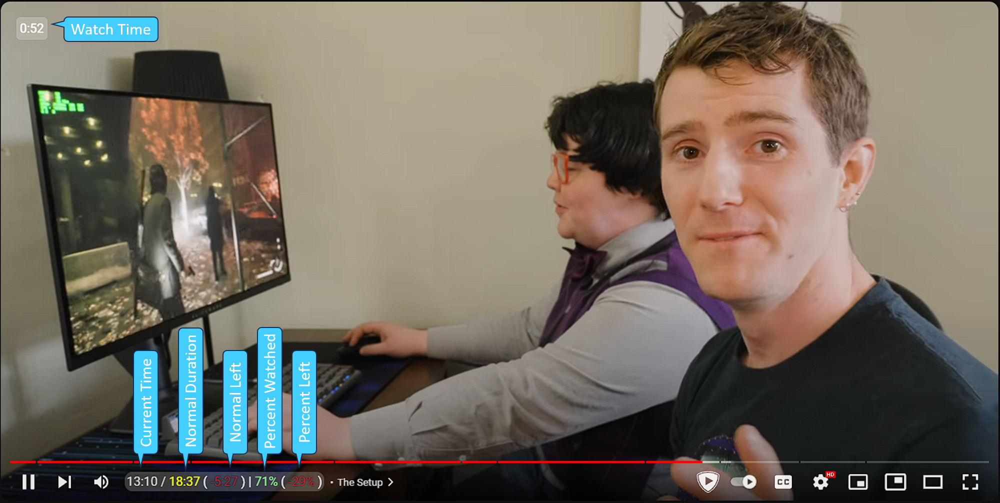
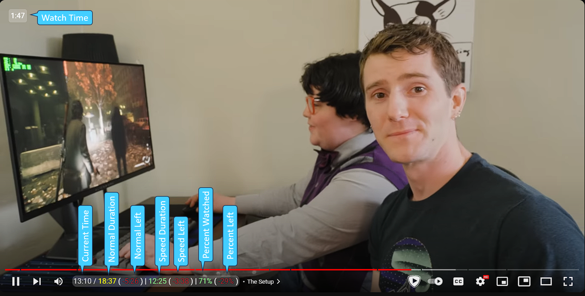

# YouTube Video More Stats

## Key Features

1. `Watch Time:` Total time(persistent) spent on a video. Storing the time in local storage(GM_setValue & GM_getValue)
2. `Current Time:` Current time of the video
3. `Normal Duration:` Duration of the video irrespective of the playback speed
4. `Normal Left:` Duration left irrespective of the playback speed
5. `Percent Watched:` Percentage of the video been watched
6. `Percent Left:` Percentage of the video left

### Playback Speed is 1 (normal)

### PlayBack Speed is not 1 (slowed/speeded)

1. `Speed Duration:` Duration of the video after being slowed/speeded
2. `Speed Left:` Duration left after being slowed/speeded

